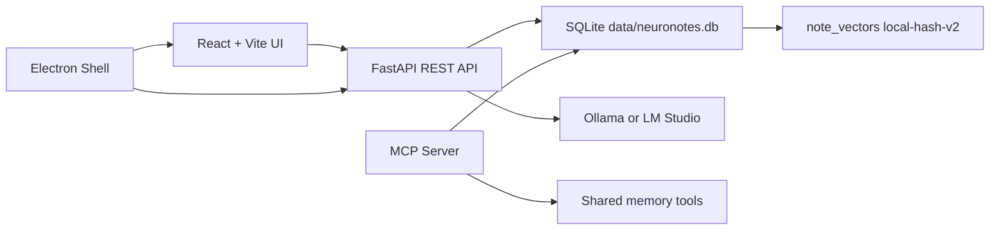

# Neuronotes 2.0 - Documentacion profunda

Ultima revision local: 2026-06-17.

Neuronotes 2.0 es una app local-first para notas, proyectos y memoria compartida entre humanos y LLMs. El objetivo no es ser un chatbot, sino un "shared brain" tipo Notion: proyectos, notas Markdown, tareas, relaciones, contexto compilable, provenance por agente y acceso neutral para modelos como Qwen, Codex, Claude o ChatGPT.

## Estado actual

- Ruta real del proyecto: `D:\Neuronotes 2.0`
- Frontend activo: `http://localhost:5173/`
- Backend activo: `http://127.0.0.1:8787`
- Base de datos local: `D:\Neuronotes 2.0\data\neuronotes.db`
- Modelo local por defecto: `qwen3:4b`
- Vector model interno: `local-hash-v2`
- Dimensiones vectoriales: `256`
- Datos actuales en SQLite:
  - `agents`: 5
  - `projects`: 16
  - `notes`: 251
  - `tasks`: 75
  - `decisions`: 4
  - `relations`: 233
  - `note_vectors`: 251
  - `activity_events`: 190

## Vision de producto

Neuronotes debe resolver tres problemas:

1. El usuario necesita un lugar limpio para pensar y escribir notas.
2. Los LLMs necesitan leer memoria estructurada sin depender de un proveedor especifico.
3. La memoria generada por agentes debe poder revisarse antes de volverse canonica.

El centro del producto es la nota. Los agentes son colaboradores que pueden buscar, resumir, clasificar, proponer relaciones, crear tareas y escribir memory patches. La app conserva la autoridad del usuario mediante estados como `draft`, `review`, `approved` y `canonical`.

## Principios

- Local-first: SQLite local como fuente de verdad.
- Privacidad por defecto: no enviar notas privadas a servicios externos sin decision explicita.
- Vendor neutral: REST y MCP permiten acceso desde distintos LLMs.
- Notion-like: interfaz limpia, proyecto primero, escritura enfocada.
- Markdown simple: suficiente para texto, listas, tablas, codigo e imagenes.
- Human-reviewed memory: los cambios importantes de agentes deben poder revisarse.
- Contexto compacto: los LLMs reciben contexto seleccionado, no todo el vault.

## Arquitectura general



## Runtime principal

### Frontend

- Tecnologia: React 19, Vite, TypeScript.
- Archivo principal: `frontend/src/App.tsx`
- Estilos: `frontend/src/app.css`
- Render root: `frontend/src/main.tsx`
- UI modes:
  - `notes`: escritura y gestion de notas.
  - `map`: mapa 3D de memoria.
  - `llm`: panel de conexion para agentes.

El frontend usa `window.neuronotes.apiBase` cuando corre dentro de Electron. En browser usa `VITE_API_BASE` o rutas relativas.

### Backend

- Tecnologia: FastAPI, SQLite, httpx.
- Entrada: `backend/app/main.py`
- Persistencia y dominio: `backend/app/database.py`
- Cliente Qwen/Ollama/LM Studio: `backend/app/ollama_client.py`
- MCP: `backend/app/mcp_server.py`

El backend inicializa SQLite en startup con `init_database()`. Si no hay proyectos, crea seed data minimo. Tambien migra columnas de nota (`folder`, `category`) si faltan.

### Desktop

- Shell: Electron.
- Entrada: `electron/main.cjs`
- Preload seguro: `electron/preload.cjs`
- En desktop, Electron inicia FastAPI local en `127.0.0.1:8787` salvo que `NEURONOTES_EXTERNAL_BACKEND=1`.
- Electron carga `frontend/dist/index.html` despues de `npm run build`.

## Modelo de datos

### `agents`

Representa al usuario y a los agentes: `user`, `qwen`, `claude`, `codex`, `chatgpt`.

Campos clave:

- `id`
- `name`
- `role`
- `color`
- `type`
- `status`
- `permissions`
- `pending_writes`

### `projects`

Agrupa notas, tareas y decisiones.

Campos clave:

- `id`
- `name`
- `goal`
- `status`
- `canonical_summary`
- `tags`
- `created_at`

### `notes`

Objeto central del sistema.

Campos clave:

- `id`
- `project_id`
- `title`
- `content`
- `type`
- `status`
- `folder`
- `category`
- `created_by_agent_id`
- `color`
- `token_count`
- `created_at`

Las notas admiten Markdown. Las imagenes se insertan como Markdown, incluidas imagenes inline `data:image/...`. Para RAG, el backend limpia los `data:image` para no meter base64 en embeddings ni snippets.

### `note_vectors`

Indice local de vectores por nota.

Campos clave:

- `note_id`
- `vector`
- `dimensions`
- `model`
- `source_hash`
- `x`, `y`, `z`
- `updated_at`

El modelo actual es `local-hash-v2` de 256 dimensiones. No es un embedding neuronal externo; es un embedding local deterministico basado en hashing de tokens. Sirve para mapa semantico local, RAG basico y relaciones visuales.

### `tasks`

Tareas del proyecto, opcionalmente ligadas a una nota fuente.

### `decisions`

Decisiones canonicas o en revision, con soporte para supersession.

### `relations`

Relaciones entre notas, tareas o decisiones.

Ejemplos:

- `related`
- `supports`
- `feeds`
- `creates_task`
- `semantic`

### `memory_patches`

Propuestas estructuradas de agentes. Se guardan como payload JSON y pueden aplicarse via `/api/memory/apply`.

### `activity_events`

Registro de actividad del workspace.

### `app_settings`

Configuracion runtime:

- `model_provider`
- `model_base_url`
- `model_name`
- `privacy_mode`

## Flujos principales

### Crear o editar una nota

1. UI envia `POST /api/notes` o `PUT /api/notes/{note_id}`.
2. Backend guarda nota en SQLite.
3. Backend ejecuta `upsert_note_vector()`.
4. Se calcula `source_hash`.
5. Si cambio el texto, modelo o dimensiones, se recalcula vector.
6. El frontend refresca notas, tareas y relaciones.

### Markdown e imagenes

1. El editor usa textarea Markdown.
2. El boton Preview renderiza con `react-markdown` y `remark-gfm`.
3. El boton de imagen lee un archivo local como data URL.
4. Inserta `` en la nota.
5. La nota conserva la imagen completa.
6. El motor RAG reemplaza base64 por texto tipo `image alt text` en excerpts y embeddings.

### Mejorar nota con Qwen

1. UI llama `POST /api/notes/{note_id}/improve`.
2. Backend intenta usar `ask_qwen_json()`.
3. Si el modelo local no responde, usa fallback heuristico.
4. Resultado normalizado puede ajustar contenido, tipo, status, folder, category, tasks y related note ids.
5. Backend actualiza nota, crea tareas y relaciones sugeridas.
6. Nota queda vectorizada automaticamente.

### Mapa 3D

1. UI llama `/api/vectors/map`.
2. Backend devuelve nodos vectoriales y edges.
3. Edges incluyen relaciones manuales y proximidad semantica local.
4. Frontend renderiza en Three.js.
5. Las notas se agrupan por `category` o `folder`.
6. El hover muestra el nombre de la nota con picking por proximidad.
7. La animacion rota suavemente el mapa y pulsa nodos seleccionados.

### Context compiler

1. Cliente llama `POST /api/context/compile`.
2. Backend lee dashboard, tareas, decisiones y notas del proyecto.
3. Tambien ejecuta `semantic_search_notes()` con el objetivo del agente.
4. Produce un contexto compacto con:
   - Goal
   - Project summary
   - Canonical decisions
   - Open tasks
   - Vector retrieved notes
   - Project notes
   - Shared memory protocol
5. El contexto evita meter base64 crudo de imagenes.

### Export para Codex

1. Cliente llama `POST /api/context/export-codex`.
2. Backend escribe archivos en `exports/codex`.
3. Archivos generados:
   - `exports/codex/AGENTS.md`
   - `exports/codex/docs/context.md`
   - `exports/codex/docs/decisions.md`
   - `exports/codex/docs/tasks.md`

### Memory patch

1. Agente envia una propuesta via `POST /api/memory-patches` o MCP `submit_memory_patch`.
2. Se guarda como pending.
3. El usuario o cliente autorizado aplica via `POST /api/memory/apply`.
4. Backend crea notas, tareas y decisiones segun payload.
5. Las notas creadas por patch se vectorizan automaticamente.

## API REST

Base URL local: `http://127.0.0.1:8787`

### Health

- `GET /api/health`
- `GET /api/health/model`

### Dashboard y proyectos

- `GET /api/dashboard?project_id=...`
- `GET /api/projects`
- `POST /api/projects`
- `PUT /api/projects/{project_id}`

### Notas

- `GET /api/notes`
- `GET /api/notes?project_id=...`
- `GET /api/notes?folder=...`
- `GET /api/notes?category=...`
- `GET /api/notes/{note_id}`
- `POST /api/notes`
- `PUT /api/notes/{note_id}`
- `POST /api/notes/{note_id}/improve`

### Tareas

- `GET /api/tasks`
- `GET /api/tasks?project_id=...`
- `POST /api/tasks`
- `PUT /api/tasks/{task_id}`

### Relaciones

- `GET /api/relations`
- `GET /api/relations?project_id=...`
- `POST /api/relations`

### Busqueda, vectores y mapa

- `GET /api/search?query=...&limit=8`
- `GET /api/vectors/search?query=...&limit=8`
- `GET /api/vectors/search?query=...&project_id=...`
- `GET /api/vectors/map`
- `GET /api/vectors/map?project_id=...`
- `GET /api/vectors/map?folder=...`
- `GET /api/vectors/map?category=...`
- `POST /api/vectors/rebuild`
- `POST /api/vectors/rebuild?project_id=...`

### Contexto y memoria

- `POST /api/context/compile`
- `POST /api/context/export-codex`
- `POST /api/memory-patches`
- `POST /api/memory/apply`
- `POST /api/inbox/analyze`

### Configuracion y actividad

- `GET /api/settings`
- `PUT /api/settings`
- `GET /api/activity`
- `GET /api/activity?project_id=...`

## MCP

Comando:

```powershell
npm run mcp
```

Servidor:

- Nombre: `neuronotes-2`
- Archivo: `backend/app/mcp_server.py`

Tools disponibles:

- `search_memory(query, limit)`
- `vector_search(query, limit, project_id)`
- `list_notes(project_id)`
- `get_project_context(project_id, target_agent, goal, token_budget)`
- `get_note(note_id)`
- `create_note(project_id, title, content, type, status, folder, category, created_by_agent_id)`
- `update_note(note_id, project_id, title, content, type, status, folder, category, created_by_agent_id)`
- `list_tasks(project_id)`
- `create_task(project_id, title, status, source_note_id, source_agent_id)`
- `update_task(task_id, project_id, title, status, source_note_id)`
- `list_relations(project_id)`
- `link_notes(from_note_id, to_note_id, relation_type, created_by_agent_id)`
- `submit_memory_patch(project_id, agent_id, payload)`

## Frontend en detalle

Archivo principal: `frontend/src/App.tsx`

Componentes principales:

- `App`: estado global, scope, proyecto seleccionado, busqueda, health del modelo.
- `ProjectSidebar`: lista de proyectos, folders, categorias y scopes.
- `Topbar`: tabs principales y busqueda global.
- `NotesWorkspace`: lista de notas, editor Markdown, tareas y relaciones.
- `MarkdownPreview`: render Markdown GFM con URL sanitizer.
- `MapWorkspace`: carga mapa vectorial y muestra inspector.
- `ThreeVectorScene`: escena Three.js, nodos, edges, hover y animacion.
- `LLMWorkspace`: rutas utiles para agentes y prompt base.

Scope de notas:

- `all`
- `project`
- `folder`
- `category`
- `loose`

Theme:

- `light`
- `dark`

El tema se guarda en `localStorage` con la key `neuronotes-theme`.

## Modelo local

Configuracion por defecto:

- Provider: `ollama`
- Base URL: `http://localhost:11434`
- Model: `qwen3:4b`

LM Studio:

- Provider: `lmstudio`
- Base URL tipica: `http://localhost:1234`
- Endpoint compatible: `/v1/chat/completions`

Ollama:

- Health: `/api/tags`
- Chat: `/api/chat`

Si el modelo no responde, las notas siguen funcionando y algunas acciones usan heuristicas locales.

## Comandos

Instalar:

```powershell
cd "D:\Neuronotes 2.0"
python -m venv .venv
.\.venv\Scripts\python -m pip install -r backend\requirements.txt
npm install
npm --prefix frontend install
```

Ejecutar en browser:

```powershell
npm run dev
```

Ejecutar solo backend:

```powershell
npm run dev:backend
```

Ejecutar solo frontend:

```powershell
npm run dev:frontend
```

Build frontend:

```powershell
npm run build
```

Desktop:

```powershell
npm run desktop
```

MCP:

```powershell
npm run mcp
```

Carga de datos demo:

```powershell
.\.venv\Scripts\python.exe scripts\load_demo_data.py
```

Validaciones usadas:

```powershell
npm --prefix frontend run build
.\.venv\Scripts\python.exe -m compileall backend\app scripts
```

## Variables de entorno

- `NEURONOTES_DB_PATH`: sobrescribe la ruta de SQLite.
- `MODEL_PROVIDER`: provider inicial (`ollama` o `lmstudio`).
- `OLLAMA_BASE_URL`: base URL inicial para Ollama.
- `QWEN_MODEL`: modelo inicial.
- `NEURONOTES_API_BASE`: API usada por Electron preload.
- `NEURONOTES_EXTERNAL_BACKEND=1`: evita que Electron levante backend propio.
- `NEURONOTES_APP_URL`: hace que Electron cargue una URL externa en vez del build local.

## Seguridad y privacidad

- El backend permite CORS abierto porque esta pensado para uso local.
- No hay autenticacion en el MVP.
- SQLite contiene la memoria real; tratar `data/neuronotes.db` como archivo sensible.
- Imagenes inline en notas se guardan dentro del contenido Markdown.
- El contexto para LLMs sanea excerpts y vector snippets para no arrastrar base64 crudo.
- La regla de producto es local-first: no enviar notas privadas a APIs externas sin aprobacion.

## Limitaciones actuales

- No hay auth ni multiusuario.
- No hay sincronizacion cloud.
- El editor no es block editor; es Markdown textarea + preview.
- El embedding `local-hash-v2` es local y deterministico, no equivale a embeddings neuronales de alto recall.
- El mapa 3D es visual y exploratorio; no reemplaza busqueda ni filtros.
- No hay migraciones versionadas formales; las migraciones actuales estan embebidas en `init_database()`.
- No hay test suite automatizado completo.

## Roadmap sugerido

- Migraciones formales para SQLite.
- Test suite backend para CRUD, vectorizacion y context compiler.
- Tests frontend de flujos principales.
- Importador de conversaciones.
- Panel de revision de memory patches.
- Export/import de vault completo.
- Backups automaticos de SQLite.
- Integracion MCP configurable desde UI.
- Mejor embeddings backend opcional manteniendo modo local.
- Permisos por agente y audit trail mas detallado.

